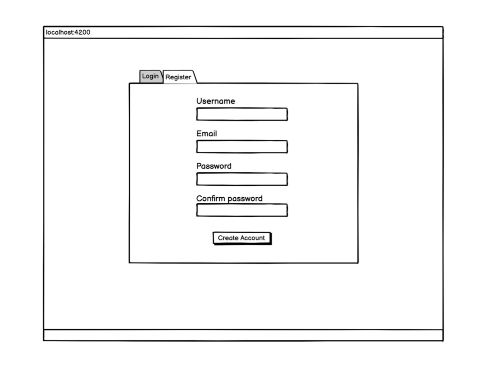

# smartengo

Smartengo is application of the famous platform ‘Medium’ using Angular (version 10) for the frontend, Symfony (version 4 or 5) based on API Platform and NodeJS for the backend connected to Relational database (SQL).

For this clone application, we have to type of users:

* Simple user
* Admin

A simple use, after signing-in, can create a new article, react to existing articles, leave a comment, edit his own articles, or even delete or unpublish one of them. Besides, the connected user can search for keywords inside the content of the articles or by tags. In addition, an admin has the right to execute any action on any articles ​except​ deleting articles.
## Architecture

### Backend

This part represents the core of the application, which is composed of two applications. The first one for authentication and authorization and the second one for providing the main endpoints of business logic.

1. Smart-Auth:

The aim of this microservice is quite simple, authenticate the users and authorize their actions. Smart-Auth will provide these endpoints that allow to:

* Create a new account (mention the role)
* Sign-in
* Change password
* Access to core endpoints (authorization)

As shown in Figure 1, every HTTP call from the front-end should be authorized by Smart-Auth. To build this microservice you have to use NodeJS. You are free to pick your framework (Express JS, Nest JS, Fastify, ...).

2. Smart - Doctrina:

This Symfony application is based on the API Platform. You have to implement the class diagram below.

### Frontend

As mentioned above the frontend application will be coded with Angular with the implementation of the ​**SSR** ​(​**S**​erver-**​S**​ider-**​R**​endering) technique. Besides you have to build these interfaces which represent the use cases describes above.

## Bonus Points:

* Think to handle the cache for the backend’s endpoints and the frontend pages.
* Implementing a search engine for fetching articles (elastic search)